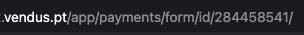

# Providers - Cegid Vendus - Configuration

The current configuration for Cegid Vendus will look like this

```php
[
    'Cegid Vendus' => [
        'key' => env('VENDUS_API_KEY', null),
        'mode' => env('VENDUS_MODE', null),
        'config' => [
            'payments' => [
                DocumentPaymentMethod::MB->value => env('VENDUS_PAYMENT_MB_ID', null),
                DocumentPaymentMethod::CREDIT_CARD->value => env('VENDUS_PAYMENT_CREDIT_CARD_ID', null),
                DocumentPaymentMethod::CURRENT_ACCOUNT->value => env('VENDUS_PAYMENT_CURRENT_ACCOUNT_ID', null),
                DocumentPaymentMethod::MONEY->value => env('VENDUS_PAYMENT_MONEY_ID', null),
                DocumentPaymentMethod::MONEY_TRANSFER->value => env('VENDUS_PAYMENT_MONEY_TRANSFER_ID', null),
            ]
        ]
    ],
]
```

## key

You can find this API key in account configuration.

## mode

They have two modes. Tests or Production. If you are in Production mode the documents you invoice will have fiscal validity (if you have AT CUD configured).

If you are in Tests mode, all your documents will be invoiced as a test document, and will not be fiscally valid.

You can read more about AT CUD <a href="https://www.vendus.pt/ajuda/comunicacao-de-series-de-faturacao/" target="_blank">here</a> and about Cegid Vendus tests mode <a href="https://www.vendus.pt/ajuda/modo-formacao-testes/" target="_blank">here</a>.

## config - payments

Payments are a tricky thing to be dealt with. Because we need to assign a method, usually poiting to a specific ID, that the system provides.

> Note - This current approach requires "static" ids to be configured, but the goal is to allow you to call the API and retrieve those ids yourself, so you can manage them however you intend to.

You can find more about the Payment Methods <a href="https://www.vendus.pt/ajuda/adicionar-metodos-pagamento/" target="_blank">here</a>.

After you have your payments configured you need to get their each of the respective IDs from the URL.



You need to take that last ID an assign to the desired payment method.

```php
// config/invoicing-integration.php
<?php

[
    // ...
    DocumentPaymentMethod::MB->value => env('VENDUS_PAYMENT_MB_ID', 284458541)
    //...
]
```

Or in the `.env` file

```bash
VENDUS_PAYMENT_MB_ID=284458541
```
