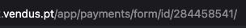

# Providers - Cegid Vendus - Configuration

Let's get your Cegid Vendus account connected to the invoicing integration. You'll need your API key, choose a mode (test or production), and map your payment methods.

Here's what the complete configuration looks like

```php
return [
    'provider' => env('INVOICING_INTEGRATION_PROVIDER'),
    'providers' => [
        'CegidVendus' => [
            'key' => env('CEGID_VENDUS_API_KEY'),
            'mode' => env('CEGID_VENDUS_MODE'),
            'payments' => [
                PaymentMethod::MB->value => env('CEGID_VENDUS_PAYMENT_MB_ID'),
                PaymentMethod::CREDIT_CARD->value => env('CEGID_VENDUS_PAYMENT_CREDIT_CARD_ID'),
                PaymentMethod::CURRENT_ACCOUNT->value => env('CEGID_VENDUS_PAYMENT_CURRENT_ACCOUNT_ID'),
                PaymentMethod::MONEY->value => env('CEGID_VENDUS_PAYMENT_MONEY_ID'),
                PaymentMethod::MONEY_TRANSFER->value => env('CEGID_VENDUS_PAYMENT_MONEY_TRANSFER_ID'),
            ],
            'units' => [
                'kg'   => env('CEGID_VENDUS_UNIT_KG_ID'),
                'unit' => env('CEGID_VENDUS_UNIT_UNIT_ID'),
            ],
        ],
    ],
];
```

## key

Your API key authenticates requests to Cegid Vendus. To find it:

1. Log in to your Cegid Vendus account
2. Go to **Definições** (Settings) → **API**
3. Copy the API key shown on that page

Store it in your `.env` file:

```bash
CEGID_VENDUS_API_KEY=your-api-key-here
```

## mode

Cegid Vendus has two modes:

| Mode           | Value        | Documents are fiscally valid? | Use for               |
| -------------- | ------------ | ----------------------------- | --------------------- |
| **Tests**      | `tests`      | No                            | Development & testing |
| **Production** | `production` | Yes (with AT CUD configured)  | Live invoicing        |

**Recommendation:** Start with `tests` mode during development. Switch to `production` only when you're ready to issue real invoices.

```bash
# .env
CEGID_VENDUS_MODE=tests
```

You can read more about AT CUD <a href="https://www.vendus.pt/ajuda/comunicacao-de-series-de-faturacao/" target="_blank">here</a> and about Cegid Vendus tests mode <a href="https://www.vendus.pt/ajuda/modo-formacao-testes/" target="_blank">here</a>.

## payments mapping

Each payment method in your code needs to map to a numeric ID from Cegid Vendus. Here's how to find those IDs:

### Step-by-step: Finding payment method IDs

1. Log in to your Cegid Vendus account
2. Go to **Definições** → **Métodos de Pagamento** (Payment Methods)
3. Click on a payment method (e.g., "Multibanco")
4. Look at the URL in your browser - the ID is the last number



5. Copy that ID and add it to your `.env` file

### Example configuration

For each payment method you use, add the corresponding ID:

```bash
# .env
CEGID_VENDUS_PAYMENT_MB_ID=284458541
CEGID_VENDUS_PAYMENT_CREDIT_CARD_ID=284458542
CEGID_VENDUS_PAYMENT_MONEY_ID=284458543
CEGID_VENDUS_PAYMENT_MONEY_TRANSFER_ID=284458544
CEGID_VENDUS_PAYMENT_CURRENT_ACCOUNT_ID=284458545
```

Or configure defaults directly in the config file:

```php
// config/invoicing-integration.php
<?php

return [
    // ...
    'providers' => [
        'CegidVendus' => [
            'payments' => [
                PaymentMethod::MB->value => env('CEGID_VENDUS_PAYMENT_MB_ID', 284458541),
                // ...
            ],
        ],
    ],
];
```

> **Note:** This approach requires configuring static IDs. A future version will allow you to fetch these IDs programmatically via the API.

You can read more about configuring payment methods in Cegid Vendus <a href="https://www.vendus.pt/ajuda/adicionar-metodos-pagamento/" target="_blank">here</a>.

## units mapping

When creating catalog items with a unit of measure, the package resolves the unit's string value to a provider ID using the `units` map in your config.

The built-in `Unit` enum ships with `kg` and `unit`. Add their IDs to your `.env`:

```bash
CEGID_VENDUS_UNIT_KG_ID=your-kg-unit-id
CEGID_VENDUS_UNIT_UNIT_ID=your-unit-id
```

If you define a custom enum implementing `ShouldBeUnit`, add an entry for each of its values:

```bash
CEGID_VENDUS_UNIT_LITRE_ID=your-litre-unit-id
CEGID_VENDUS_UNIT_HOUR_ID=your-hour-unit-id
```

```php
// config/invoicing-integration.php
'units' => [
    'kg'    => env('CEGID_VENDUS_UNIT_KG_ID'),
    'unit'  => env('CEGID_VENDUS_UNIT_UNIT_ID'),
    'litre' => env('CEGID_VENDUS_UNIT_LITRE_ID'),
    'hour'  => env('CEGID_VENDUS_UNIT_HOUR_ID'),
],
```
